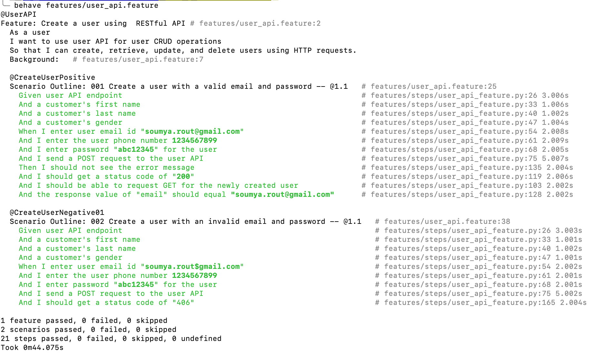

# Behavior-driven testing (or BDT)

Behavior-driven testing (or BDT) is an agile software testing technique that encourages collaboration between developers, QA and non-technical or business participants in a software project.

---

## Execute test from command line
### Sample output


1. To trigger all test at once.
```shell 
behave 
```
3. To trigger test for specific **feature**.
```shell 
behave features/user_api.feature
```
4. To trigger test for specific **tag** in a **scenario**.
```shell 
behave features/user_api.feature --tags=CreateUser
```
5. To trigger test for multiple **tags** in a **feature**.
```shell 
behave features/user_api.feature --tags=CreateUser,UpdateUser
```
6. The command shall not execute the **Scenario** which is tagged with **UpdateUser**.
```shell 
behave features/user_api.feature --tags=~UpdateUser
```
---

## Execute test using docker
### Sample output


1. Build docker image
```shell
docker build -t bdd-test .
```
2. To trigger test using docker image.
```shell
docker run bdd-test
```
3. To trigger feature using docker argument.
```shell
docker run -it bdd-test features/user_api.feature
```
4. To trigger a specific tag or scenario from feature
```shell
docker run -it bdd-test features/user_api.feature --tags=CreateUser
```
## Directory structure

Next, you’ll add a new file to this repository.
### Feature files
1. [User API Feature](features/user_api.feature)

### Steps directory
[Steps Directory For Features](features/steps)

### Steps for features
1. [Steps For User API](features/steps/user_api_feature.py)

---
## License

MIT License

Copyright (c) 2022 Rendered Text

Permission is hereby granted, free of charge, to any person obtaining a copy
of this software and associated documentation files (the "Software"), to deal
in the Software without restriction, including without limitation the rights
to use, copy, modify, merge, publish, distribute, sublicense, and/or sell
copies of the Software, and to permit persons to whom the Software is
furnished to do so, subject to the following conditions:

The above copyright notice and this permission notice shall be included in all
copies or substantial portions of the Software.

THE SOFTWARE IS PROVIDED "AS IS", WITHOUT WARRANTY OF ANY KIND, EXPRESS OR
IMPLIED, INCLUDING BUT NOT LIMITED TO THE WARRANTIES OF MERCHANTABILITY,
FITNESS FOR A PARTICULAR PURPOSE AND NONINFRINGEMENT. IN NO EVENT SHALL THE
AUTHORS OR COPYRIGHT HOLDERS BE LIABLE FOR ANY CLAIM, DAMAGES OR OTHER
LIABILITY, WHETHER IN AN ACTION OF CONTRACT, TORT OR OTHERWISE, ARISING FROM,
OUT OF OR IN CONNECTION WITH THE SOFTWARE OR THE USE OR OTHER DEALINGS IN THE
SOFTWARE.
